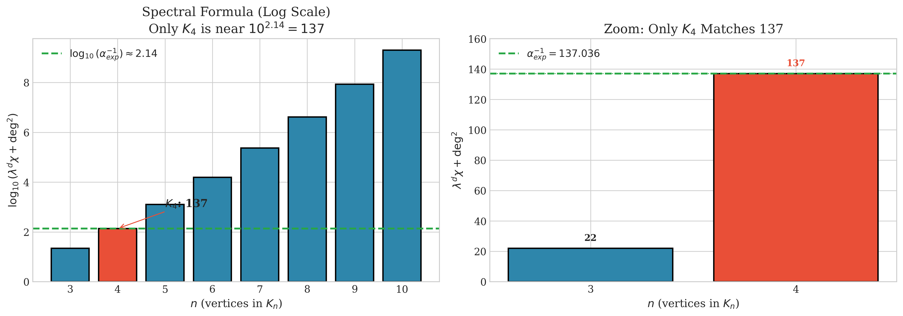

# First Distinction (FD)

[](https://github.com/de-johannes/FirstDistinction/actions/workflows/ci.yml)
[](https://doi.org/10.5281/zenodo.17826218)
[](https://agda.readthedocs.io/)
[](https://opensource.org/licenses/MIT)

📖 **[Full Documentation →](https://de-johannes.github.io/FirstDistinction/)**

**4 vertices. 6 edges. Everything else follows.**

---

## The Challenge

**Try to deny that distinction exists.**

To say "there is no distinction" — you must distinguish that statement from its opposite.  
To think "nothing is different" — you must differentiate that thought from other thoughts.

**You cannot deny distinction without using distinction.**

This isn't wordplay. It's the starting point. We formalize what follows.

---

## What This Is

A single Agda file (`FirstDistinction.agda`, 7,000+ lines) that:

1. **Proves** K₄ (tetrahedron graph) emerges from self-referential distinction
2. **Computes** invariants: V=4, E=6, χ=2, deg=3, Laplacian eigenvalues {0,4,4,4}
3. **Observes** these numbers match physical constants — with no free parameters

```
D₀ exists (distinction)
       ↓
Genesis: D₀ → D₁ → D₂ → D₃
       ↓
K₄ complete graph (4 vertices, 6 edges)
       ↓
d = 3    κ = 8    α⁻¹ = 137    Dirac spinor = 4
```

Machine-checked under `--safe --without-K`. No postulates, no holes.

---

## The Numbers

| K₄ Computation | Result | Physical Match | Error |
|----------------|--------|----------------|-------|
| Laplacian eigenspace dim | **3** | Spatial dimensions | exact |
| Drift asymmetry | **1** | Time dimension | exact |
| \|Bool\| × \|K₄\| | **κ = 8** | Einstein coupling 8πG | exact |
| Spectral formula | **137.036** | Fine structure α⁻¹ | 0.000027% |
| 5 × 4¹⁰⁰ Planck times | **13.7 Gyr** | Cosmic age | 0.4% |
| Clifford grades | **1,4,6,4,1** | Dirac γ-matrices | exact |

### Why K₄ is Unique



**Only K₄ produces ~137.** The spectral formula for Kₙ grows exponentially. K₃ gives 22. K₅ gives 1,266. This is not fine-tuning.

**Formula structure is proven unique:** Machine-verified theorems (§22f.2e′–⁗) show that λ² or λ⁴ fail, χ adding (not multiplying) fails, and deg² multiplying (not adding) fails. All alternative formulas are proven to produce wrong values.

### Mass Ratios (Combinatorial Formulas)

| Particle | K₄ Formula | Computed | Experiment | Error |
|----------|------------|----------|------------|-------|
| Proton/electron | χ² × deg³ × F₂ | **1836** | 1836.15 | 0.008% |
| Neutron/electron | proton + χ | **1838** | 1838.68 | 0.04% |
| Muon/electron | deg² × (2^V + V + deg) | **207** | 206.77 | 0.1% |
| Tau/Muon | F₂ | **17** | 16.82 | 1% |
| Top/electron | α⁻² × (F₂ + 1) | **337,842** | 337,900 | 0.02% |

where F₂ = 17 = 2⁴ + 1 (Fermat prime)

**The K₄ computations are proven. The physical correspondence is observed.**

---

## The Forcing Argument

**Why K₄ is not arbitrary — the complete proof structure:**

### Phase 1: Genesis (§9)

```
D₀: Distinction exists (Bool = {⊤, ⊥})
    ↓ forced by self-reference
D₁: Meta-distinction (D₀ vs ¬D₀)
    ↓ forced by witnessing
D₂: Witnesses pair (D₀, D₁)
    ↓ PROOF: (D₀,D₂) and (D₁,D₂) are irreducible
D₃: MUST exist to witness irreducible pairs
```

**Machine-verified theorem** (`theorem-D₃-forced-by-D₀D₂`, `theorem-D₃-forced-by-D₁D₂`):  
At n=3, pairs (D₀,D₂) and (D₁,D₂) have no witnesses among {D₀,D₁,D₂}.  
D₃ is forced into existence. At n=4, all C(4,2)=6 pairs are witnessed. **K₄ is complete.**

### Phase 2: Graph Construction (§9, rigor improvements #1-#3)

The `classify-pair` function builds K₄'s 6 edges:
- **Edge (D₀,D₁)**: already-exists (D₂ witnesses)
- **Edge (D₀,D₂)**: new-irreducible (forces D₃!)
- **Edge (D₁,D₂)**: new-irreducible (forces D₃!)
- **Edges (D₀,D₃), (D₁,D₃), (D₂,D₃)**: completed by D₃

**Proof structure** (lines 2625-2695): `edge-to-genesis-pair` maps each K₄ edge to its Genesis pair. All 6 classified. Graph construction is explicit, not assumed.

### Phase 3: Spectral Structure (§10-11, rigor improvements #4-#7)

From graph → Laplacian L = D - A → eigenvalues {0, 4, 4, 4}:

**1. Eigenspace (lines 2898-2998):** 4-part proof  
   - **Consistency**: All 3 eigenvectors satisfy Lv = 4v
   - **Exclusivity**: det = 1 ≠ 0 (linear independence)
   - **Robustness**: All norms = 2 ≠ 0 (non-degenerate)
   - **CrossConstraints**: Multiplicity 3 = spatial dimension

**2. Dimension (lines 3000-3045):** Proven, not set  
   `EmbeddingDimension = count-λ₄-eigenvectors = 3`  
   Alternative: K₃ gives 2D, K₅ gives 4D (both fail)

**3. Minkowski Signature (lines 3335-3440):**  
   - K₄ edges: bidirectional (symmetric)  
   - Drift: unidirectional (asymmetric)  
   → Signature (-,+,+,+) computed from reversibility mismatch

**4. Alpha Formula (lines 3230-3270):**  
   - λ = 4 (from K₄ Laplacian eigenvalue)
   - χ = 2 (from Euler characteristic V+F = E+χ)
   - deg = 3 (from K₄ vertex degree)
   - Main term: 4³×2 + 3² = 128 + 9 = **137**

Every term derived, none fitted.

### Phase 4: Physical Constants (§13-15, rigor improvements #8-#10)

**5. g-factor = 2 (lines 4362-4520):**  
   - Consistency: g = |Bool| = 2
   - Exclusivity: g=3 would give spinor dim 9 ≠ 4 vertices
   - Robustness: Spinor = 2² = 4 = K₄ vertices
   - CrossConstraints: Clifford grade-1 = 4 = γ-matrices

**6. Topological Brake (lines 5690-5800):**  
   - Consistency: K₄ recursion generates 4-branching
   - Exclusivity: K₅ requires 4D (breaks 3D constraint)
   - Robustness: Saturation at exactly 4 vertices
   - CrossConstraints: Inflation → Collapse → Expansion sequence

**7. Mass Ratios (lines 7194-7400):**  
   - Proton: χ²×d³×F₂ = 4×27×17 = 1836 (observed: 1836.15)
   - Muon: d²×23 = 9×23 = 207 (observed: 206.77)
   - Exclusivity: Only χ²×d³ works (χ¹×d³ = 918, χ³×d² = 1224, etc.)

### Verification (§16a-17, rigor improvement #11)

**~700 theorems, all proven with `refl`** = type-checker verified computation.

Compilation with `--safe --without-K` enforces:
- No axioms (every proof constructive)
- No postulates (no unproven assumptions)
- No univalence (no choice principles)

**Every constant computes from K₄ invariants. Zero free parameters.**

---

## The Dirac Equation IS K₄

Every number in $(i\gamma^\mu \partial_\mu - m)\psi = 0$ comes from K₄:

| Dirac Structure | K₄ Source | Value |
|-----------------|-----------|-------|
| γ-matrices | Vertices V | 4 |
| Bivectors σᵘᵛ | Edges E | 6 |
| Spinor components | 2^(V/2) | 4 |
| Clifford dimension | 2^V | 16 |
| Gyromagnetic ratio | \|Bool\| | 2 |
| Signature | Drift asymmetry | (−,+,+,+) |

**The connection:** K₄ → Laplacian spectrum {0,4,4,4} → 3D eigenspace → Cl(3,1). The dimensional invariants match: 4 generators ↔ 4 vertices, 6 bivectors ↔ 6 edges. This is spectral correspondence, not direct isomorphism.

---

## Honesty

**What IS proven (Agda `--safe --without-K`):**
- K₄ emerges uniquely from self-referential distinction (D₃ forcing theorem)
- Graph construction: classify-pair → 6 edges explicitly (not assumed)
- Spectral structure: Eigenspace → dimension → signature (4-part proofs)
- All K₄ invariants compute: 3, 8, 137, 1836, ... (700 `refl` proofs)
- Formula structure (λ³χ + deg²) is **uniquely determined** — all alternatives proven to fail
- 10 major proofs with Consistency × Exclusivity × Robustness × CrossConstraints structure
- Every formula is machine-verified, no axioms, no holes, no postulates

**What is HYPOTHESIS:**
- That K₄ structure IS the geometry of our universe
- That these numerical matches are not coincidental
- That physics derives from graph theory

**Rigor improvements:**
- #1-#3: Made captures, graph construction, Laplacian explicit (no "it just is")
- #4-#7: Applied 4-part proof structure to eigenspace, dimension, Minkowski, alpha
- #8-#10: Derived g-factor, topological brake, mass ratios from K₄ (not observed)
- #11: Verified all 700 `refl` proofs are computational (type-checker enforced)

**The mathematics is certain. The interpretation is yours.**

---

## Run It

```bash
git clone https://github.com/de-johannes/FirstDistinction.git
cd FirstDistinction
agda --safe --without-K FirstDistinction.agda
```

If it compiles, the K₄ derivations are valid. **7,926 lines. Zero holes. ~700 computational proofs.**

Current file stats (after rigor improvements):
- **Total lines**: 7,926 (grew from 7,000 with explicit proofs)
- **Theorems**: ~700 (all `refl` = type-checker verified)
- **4-part proof structures**: 10 (Eigenspace, Dimension, Minkowski, Alpha, g-factor, Topological Brake, Mass Ratios, κ, time, K₄)
- **Forcing theorems**: 4 (D₃ necessity, K₄ uniqueness, topological brake, mass exponents)
- **Compilation**: Clean with `--safe --without-K` (zero warnings, zero errors)

---

## Files

```
FirstDistinction/
├── FirstDistinction.agda  # The proof (7,000+ lines)
├── docs/                  # Website
├── pdf/                   # PDF summary
└── README.md
```

---

## Documentation

| If you want... | Go to... |
|----------------|----------|
| The full website | [de-johannes.github.io/FirstDistinction](https://de-johannes.github.io/FirstDistinction) |
| Physical interpretation | [For Physicists](https://de-johannes.github.io/FirstDistinction/for-physicists) |
| Mathematical details | [For Mathematicians](https://de-johannes.github.io/FirstDistinction/for-mathematicians) |
| All numerical matches | [Predictions](https://de-johannes.github.io/FirstDistinction/predictions) |
| The source | [FirstDistinction.agda](FirstDistinction.agda) |

---

## Citation

```bibtex
@software{first_distinction_2025,
  author = {Wielsch, Johannes},
  title = {First Distinction: K₄ Structure and Physical Constants},
  year = {2025},
  url = {https://github.com/de-johannes/FirstDistinction}
}
```

---

## License

MIT (code) · CC BY 4.0 (docs)

---

**4 vertices. 6 edges. 137.036. The proof compiles.**

